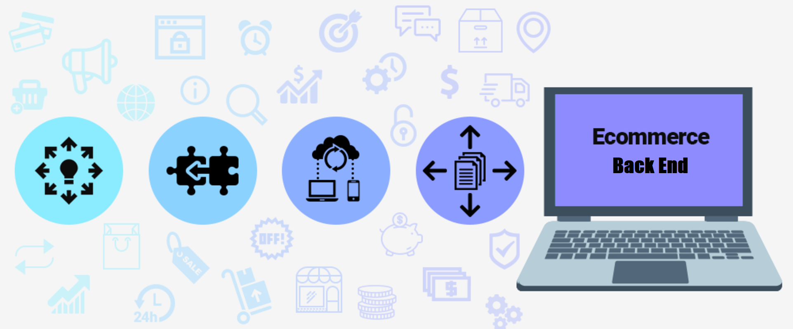

<h1 align="center"> Object-Relational Mapping (ORM)
<br>E-Commerce Back End 👋</h1>
<p align="center">
  <a href="#">
  
  <a href="#">
  
  <a href="#">
  
  <a href="#">
  
  <a href="#">
  
  <a href="#">
  
  <br>
  <a href="https://www.buymeacoffee.com/adampham123">
  
  <a href="#">
  
  <a href="#">
  
  <a href="https://github.com/ThiHoangPham/e-commerce-back-end/blob/main/LICENSE">
  
  </a>
  <a href="#">
  
  <a href="#">
  
  </a>
  <a href="#">
  
  </a>
  <a href="#">
  
  </a>
  <a href="https://twitter.com/AdamThaiHoang1">
  
  </a>
</p>
<hr>

## Description:
Building the back end for an e-commerce site by modifying starter code, and configuring a working Express.js API to use Sequelize to interact with a MySQL database.

## User Story:
```
AS A manager at an internet retail company
I WANT a back end for my e-commerce website that uses the latest technologies
SO THAT my company can compete with other e-commerce companies
```
## Acceptance Criteria
```
GIVEN a functional Express.js API
WHEN I add my database name, MySQL username, and MySQL password to an environment variable file
THEN I am able to connect to a database using Sequelize
WHEN I enter schema and seed commands
THEN a development database is created and is seeded with test data
WHEN I enter the command to invoke the application
THEN my server is started and the Sequelize models are synced to the MySQL database
WHEN I open API GET routes in Insomnia Core for categories, products, or tags
THEN the data for each of these routes is displayed in a formatted JSON
WHEN I test API POST, PUT, and DELETE routes in Insomnia Core
THEN I am able to successfully create, update, and delete data in my database
```
## Table of Contents:
- [Description](#description)
- [User Story](#user-story)
- [Acceptance Criteria](#acceptance-criteria)
- [Walkthrough Video](#walkthrough-video)
- [Installation](#installation)
- [Usage](#usage)
- [Contributor](#contributor)
- [Contribution](#contribution)
- [Contact Information](#contact-information)

## Walkthrough Video: 
<a href="https://watch.screencastify.com/v/9oCCoU1y7ynGQIC5GR2T">
  
  </a>

## Installation:
`npm install`

## Usage:
Run the following command at the root of your project and answer the prompted questions:

`mysql -u root -p`

`source db/schema.sql`

`quit`

`npm run seed`

`npm start`

## Contributor:
<a href="https://github.com/ThiHoangPham">
  
  </a>

## Contribution:
Please email to me if you have any contribution, I am more than happy with that. Thank you!

## Contact Information:

Github: [Thai Hoang(Adam), Pham](https://github.com/ThiHoangPham)

Email: thaihoangpham2008@gmail.com

<p align ="right"><a href="#">↥ back to top</a></p>

- - -

© 2021 Thai Hoang(Adam), Pham: Employee Tracker
